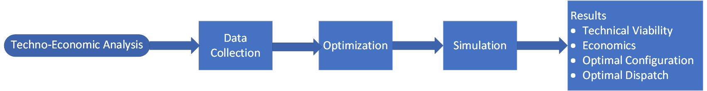

# Microgrid Design with Simscape
The International Council on Large Electric Systems (CIGRE) defines microgrids as 
‘electricity distribution systems containing loads and distributed energy resources, 
(such as distributed generators, storage devices, or controllable loads) that can be
 operated in a controlled, coordinated way either while connected to the main power 
network or while islanded’.

## Design, Operation, and Control of Remote Microgrid
There are different types of microgrid applications such as residential microgrids, 
remote microgrids, industrial microgrids, and many more. This example shows the 
operation of a remote microgrid with diesel generator, battery energy storage 
system, photovoltaic, and loads in Simscape&trade;.

Microgrids developed in remote places ensure reliable and uninterrupted power. 
The microgrid controller ensures economic and sustainable energy mix while 
maximizing fuel saving with stable renewable energy integrations. To learn 
how to develop, evaluate, and operate a remote microgrid, see the Design, 
Operation, and Control of Remote Microgrid example.
The planning objectives in this remote microgrid example include power 
reliability, renewable power usage, and reduction in diesel consumption.
 The key indices for economic benefits for the remote microgrid include life
 cycle cost, net revenue, payback period, and internal rate of return. 

## Design of Stable Industrial Microgrid
In this example, these indices are improved through reduction in diesel
 usage, maximum usage of renewable energy, and operation of the BESS.
 This example uses various standards for covering, planning, designing,
 controlling, and testing. The control performance evaluation includes 
conformation of standards for power quality.

The second example is about industrial microgrid. In an industrial microgrid, 
the planning objectives are ensuring power reliability, minimize downtime, 
faster system reconfiguration during fault and cost optimization. Electrical 
design covers the voltage selection, network structure, grounding etc. while 
the automation design ensures system protection, monitoring, communication etc. 
In this example, two main grids connect through two primary substations. Each 
substation has one BESS units and one microgrid controller. The industrial grid
 operates as two microgrids connected through a normally open switch. 

This figure shows various aspects from different standards considered in this workflow. 
The microgrid standards and industrial process standard are mapped at different control levels.

## Perform Techno-Economic Analysis of Microgrids
The third example is about techno-economic analysis of microgrids. Techno-economic analysis
 of microgrids is a comprehensive study that integrates technical performance and economic viability
 to assess the feasibility and effectiveness of different microgrids. Microgrids comprise multiple 
distributed energy resources (DERs) including solar panels, wind turbines, generators, 
combined heat and power (CHP) plants, energy storage systems, and controllable loads. 
To meet the energy demands while minimizing the overall cost, the techno-economic analysis 
identifies the optimal configuration and operation of these components

This flowchart describes the steps of a techno-economic analysis in this example

## Setup
* Clone and add the repository to the MATLAB&reg; path.
* Open MicrogridDesignWithSimscape.prj.
* In the toolstrip, use the project shortcut buttons to open the example.
* This example requires MATLAB R2024a or later.

Copyright 2022-2024 The MathWorks, Inc.

